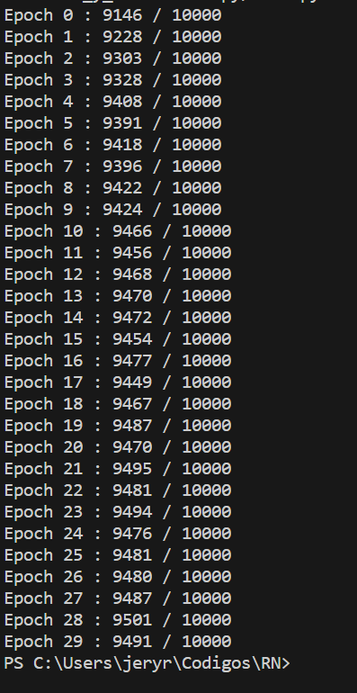

# Optimizador BackProp con inercia.

1.  Implementar sobre su codigo de red neuronal de la tarea anterior, algun optimizador visto en clase (RMS, BackProp con inercia, Adam).
2.  Hacer captura de pantalla resultante de haber corrido el codigo.
3.  Hacer commit con descripcion de lo hecho y si mejoró o no el porcentajede aciertos. ¿Qué porcentaje?.
4.  Empujar  (push)  su  codigo  a  github.   (verificar  que  los  archivos  en  git-hub.com contengan los cambios y la captura de pantalla)

---

En el siguiente [link](https://github.com/Jeremy-22/RN/blob/main/Optimizador_y_Cross-Entropy/Optimizador/PRN1.py)
se puede visualizar el codigo con la implementación del otimizador BackProp con inercia

  

Se puede apreciar se comienza con una eficiencia de 91.46% y termina con una eficiencia de 94.91%, esto con respecto a la red sin implementar el optimizador se puede apreciar que comienza con mejor eficiencia pero termina con una menor.
